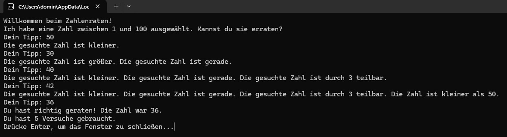
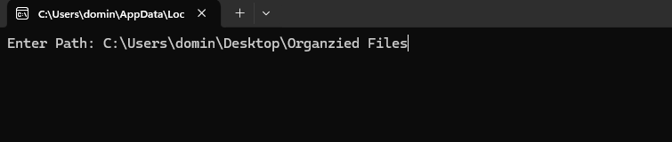

# 👋 **Dominik-Portfolio**

## Willkommen in meinem Portfolio ✨

Hier sehen Sie meine ersten Schritte in der **Datenanalyse** mit **Excel** und **Power BI**, der **Python-Programmierung** und der kreativen Nutzung von **Prompts mit ChatGPT**.

---

### 📚 **Über mich**

Ich bin 20 Jahre alt und bewerbe mich bei **HOCHTIEF** für eine Ausbildung im Bereich **Daten- und Prozessanalyse**. In diesem Portfolio möchte ich meine bisherigen Erfahrungen und Projekte vorstellen, die mich auf diesem Weg begleiten.

---

## 🌟 **Warum Daten und Prozesse?**

Mich fasziniert, wie man mit Daten **Prozesse** besser verstehen und **optimieren** kann. Es interessiert mich, herauszufinden, wo in Prozessen Herausforderungen liegen und wie man durch den Einsatz der richtigen Werkzeuge **effiziente Lösungen** finden kann.

Ich möchte lernen, mit Tools wie **Python**, **Excel** und **Power BI** und zu arbeiten. Dieses Portfolio stellt meinen ersten Schritt auf diesem aufregenden Weg dar.

---

#  Meine ersten Projekte

## Daten und Analyse

### Projekt: Trainingsplan-Analyse mit Excel und Power BI
### In meinem ersten Projekt habe ich einen Trainingsplan in Excel erstellt und die Daten mit Power BI analysiert. Ich habe untersucht, auf welche Muskelgruppen ich das meiste Gewicht trage, um zu sehen, ob mein Training gleichmäßig verteilt ist, und an welchen Tagen ich den höchsten Kalorienverbrauch habe.
### Technologien: Excel, Power BI

**[Trainingsplan]** Zuerst habe ich ein präzises Prompt an ChatGPT geschrieben, um spezifische Daten zu erhalten.

**[Excel]** Diese Daten habe ich dann in einer Excel-Tabelle gespeichert.

**[PowerBI]** Schließlich habe ich die Daten in Power BI weiter bearbeitet und die einzelnen Schritte durch entsprechende Bilder veranschaulicht.

---
 
# Nutzung von einer Künstlichen Intelligenz

## In diesem Projekt habe ich Prompts entwickelt, die automatisch Bilder generieren. Dabei habe ich gelernt, wie man Daten in Form von Prompts verarbeitet und Prozesse automatisiert, um effiziente Ergebnisse zu erzielen.

**[KI-generierte Bilder]** Ich habe ein Prompt erstellt, um meine Katze als realistische menschliche Figur zu generieren. Ein weiteres Prompt zeigt einen Jungen, der auf einer Bühne Trompete spielt. Beide Schritte sind in separaten Bildern veranschaulicht.

### Ich habe mir zusätzlich grundlegende Kenntnisse in Python angeeignet und bereits kleinere Projekte mithilfe von ChatGPT umgesetzt. 

**[Spielentwicklung mit ChatGPT]** Dieses Python-Spiel wurde mit einem ChatGPT-Prompt erstellt, bei dem der Computer eine Zahl auswählt und der Benutzer diese erraten muss. In dem Spiel geht es darum, eine bestimmte Zahl von 1-100 zu erraten.

### Das Bild zeigt die Ausführung des Konsolenspiels „GuessTheNumber“. In der Eingabeaufforderung wird gerade eine Zahl eingegeben, um die vom Programm zufällig gewählte Zahl zu erraten. Mit jedem Versuch gibt das Spiel Hinweise.

**[Automatische Ordnersortierung]** Mit Hilfe von ChatGPT habe ich einen Python-Code erstellt, der automatisch meinen Ordner sortiert. Der Code organisiert Dateien nach Typ, was das Verwalten von Dateien deutlich vereinfacht.

### Das Bild zeigt die Ausführung eines File-Organizer-Programms in der Eingabeaufforderung. Nach Eingabe des Ordnerpfads wird der Inhalt automatisch nach Dateitypen sortiert.

### Das Bild zeigt den Ordner nach der Sortierung. Die Dateien wurden automatisch in die Unterordner „JPG“, „PNG“, „INK“ und „URL“ verschoben – entsprechend ihrer Dateiendungen.

