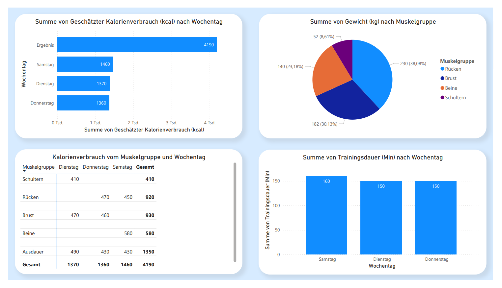

# Dominik-Portfolio

# Meine ersten Schritte in Datenanalyse mit Excel und Power BI, Python-Programmierung und kreativen Prompts mit ChatGPT

Willkommen in meinem Portfolio

Ich bin 20 Jahre alt und bewerbe mich bei **HOCHTIEF** für eine Ausbildung im Bereich **Daten- und Prozessanalyse**.

---

## Warum Daten und Prozesse?

Mich interessiert, wie man mit Daten Abläufe besser verstehen und optimieren kann. Ich finde es spannend herauszufinden,  
wo es in Prozessen hakt und wie man mit den richtigen Werkzeugen Lösungen finden kann.

Ich möchte lernen, wie man mit Tools wie **Python**, **Excel**, **Power BI** oder **SQL** arbeitet und das hier ist mein erster Schritt.

---

##  Meine ersten Projekte

### Daten und Analyse

## Projekt: Trainingsplan-Analyse mit Excel und Power BI
## In meinem ersten Projekt habe ich einen Trainingsplan in Excel erstellt und die Daten mit Power BI analysiert. Ich habe untersucht, auf welche Muskelgruppen ich das meiste Gewicht trage, um zu sehen, ob mein Training gleichmäßig verteilt ist, und an welchen Tagen ich den höchsten Kalorienverbrauch habe.
## Technologien: Excel, Power BI

**[Trainingsplan]** Zuerst habe ich ein präzises Prompt an ChatGPT geschrieben, um spezifische Daten zu erhalten.

**[Excel]** Diese Daten habe ich dann in einer Excel-Tabelle gespeichert.

**[PowerBI]** Schließlich habe ich die Daten in Power BI weiter bearbeitet und die einzelnen Schritte durch entsprechende Bilder veranschaulicht.

---
 
### Nutzung von einer Künstlichen Intelligenz

**[KI-generierte Bilder]** Ich habe ein Prompt erstellt, um meine Katze als realistische menschliche Figur zu generieren. Ein weiteres Prompt zeigt einen Jungen, der auf einer Bühne Trompete spielt. Beide Schritte sind in separaten Bildern veranschaulicht.

### Ich habe mir zusätzlich grundlegende Kenntnisse in Python angeeignet und bereits kleinere Projekte mithilfe von ChatGPT umgesetzt. 

**[Spielentwicklung mit ChatGPT]** Dieses Python-Spiel wurde mit einem ChatGPT-Prompt erstellt, bei dem der Computer eine Zahl auswählt und der Benutzer diese erraten muss. In dem Spiel geht es darum, eine bestimmte Zahl von 1-100 zu erraten.

**[Automatische Ordnersortierung]** Mit Hilfe von ChatGPT habe ich einen Python-Code erstellt, der automatisch meinen Ordner sortiert. Der Code organisiert Dateien nach Typ, was das Verwalten von Dateien deutlich vereinfacht.

